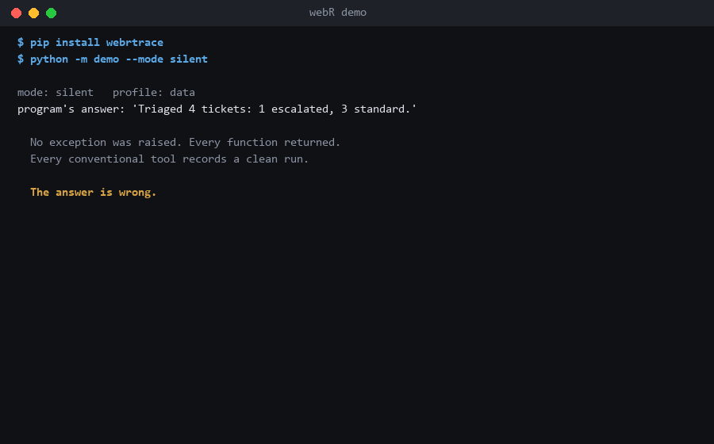

# webR

**Causality tracing for multi-agent AI systems.** Find the node that broke the chain.

[](https://github.com/Milol0608/webR/actions/workflows/ci.yml)
[](https://www.python.org/downloads/)
[](LICENSE)
[](pyproject.toml)

```bash
pip install webrtrace
```



**New here?** See it catch a real silent failure before you integrate anything — no API key,
no setup:

```bash
git clone https://github.com/Milol0608/webR && cd webR
pip install -e .
python -m demo --mode silent --open
```

That runs a five-agent pipeline that returns a confident, wrong answer with zero exceptions,
and opens an HTML report showing exactly which node poisoned it. Then read
[Is webR for you?](#is-webr-for-you) to decide if it fits your system.

---

## The problem

When a multi-agent system fails, it usually does not crash.

A summarizer invents a revenue figure. A planner returns prose where the next agent
expected JSON. An extractor politely explains that it does not have access to the file,
and the orchestrator — which only checks for exceptions — passes that sentence downstream
as if it were data. Three hops later you get an answer that is confidently, fluently
wrong, and there is no stack trace, no error code, and no log line saying where it started.

Conventional tracing does not help, because conventional tracing answers *"what was
slow?"*. The question here is *"which node was the first one to be wrong?"* — and worse,
the edge that carried the wrongness is often invisible to the call stack:

```python
plan = planner()              # produces a plan
...                           # 200 lines later, a different task
result = executor(plan)       # consumes it
```

Nothing structurally connects `planner` to `executor`. Yet a bad plan is exactly how these
systems fail.

## The solution

webR builds a **directed acyclic graph of your agents at runtime**. Each traced call is a
node. Call relationships become `INVOKES` edges automatically; data dependencies become
`SENDS` edges when you declare them. Every node carries a fingerprint of what went in and
what came out, plus signals from cheap heuristics that look for the shapes silent failure
tends to take.

When something goes wrong, the web tells you where.

```python
from webrtrace import webR_node

@webR_node
async def planner(task: str) -> str:
    ...
```

That is the entire integration. No context objects threaded through signatures, no changes
to call sites, no configuration required.

### Documentation

| | |
|---|---|
| [User guide](docs/USING.md) | A playbook organised by symptom: *my agent returned something wrong, now what* |
| [How webR works](docs/INTERNALS.md) | The mechanisms, module by module, and why each decision went the way it did |
| [`examples/`](examples/) | Six runnable examples, no API key required |
| [`demo/`](demo/) | A five-agent app in three modes — `python -m demo --mode silent --open` |

---

## Is webR for you?

webR is a **silent-failure tracer**. Its job is to make visible the failures that do not
raise — the ones every exception-based tool records as a clean run. That framing, not "LLM
observability", is what decides whether it fits.

**Reach for it when:**

- You run a **multi-agent LLM system** and a wrong answer arrives with no stack trace.
- You run an **ML, embedding, or data pipeline** where a dead vector, a NaN, an all-zero
  tensor, or an empty frame flows downstream and quietly ruins the result. webR's value
  detectors and the `data` profile are built for exactly this — it is **not** LLM-only.
- Your code has **defensive `except` blocks** that swallow an error and substitute a
  fallback. Your program reports success; webR's taint shows the answer was built on a
  failure.
- You want **per-agent token accounting** — including refusals and truncations you were
  billed for — without wiring a callback into every call site.

**It is probably overkill when:**

- You make a **single LLM call** and check the result inline. One `if` beats a tracer.
- You only need **latency tracing** across services — use OpenTelemetry; that is what it is
  for, and webR does not replace it.
- You are on a **hot path at thousands of calls per second.** webR adds ~12µs per node and
  has no sampling; it is built for agent-scale (calls measured in milliseconds), not
  request-scale.

**What it catches:** fabricated figures, refusals passed off as answers, format collapse,
truncation, no-op passthroughs, degenerate repetition, dead vectors, NaN/inf, empty
results — plus anything you can express as a `check=`.

**What it cannot catch — stated plainly so you never trust it further than it goes:** a
fluent, well-formed, plausible sentence that is simply *false*. The detectors are lexical
and structural; telling a correct total from an invented one needs semantic understanding,
which webR does not have. Encode what you can as a `check=`; that is the layer that catches
meaning.

See the [FAQ](#faq) for how it compares to LangSmith, Langfuse, and OpenTelemetry.

---

## Quickstart

```python
import asyncio
import webrtrace
from webrtrace import webR_node

webrtrace.start_writer("traces/run.jsonl")   # optional: survive a crash

@webR_node(attributes={"model": "opus-4.8"})
async def llm_call(prompt: str) -> str:
    ...

@webR_node(check=lambda out: out.strip().startswith("{"))
async def extractor(text: str) -> str:
    ...

@webR_node
async def worker(i: int) -> dict:
    return await extractor(await llm_call(f"plan-{i}"))

@webR_node
async def orchestrator() -> list:
    return await asyncio.gather(*(worker(i) for i in range(5)), return_exceptions=True)

asyncio.run(orchestrator())

web = webrtrace.export_graph()
print(web["stats"])
```

Reconstructing the failure chain from the exported document:

```
nodes=16 edges=15 by_status={'ok': 14, 'error': 2}

failure chain:
  orchestrator -> worker -> extractor   [ValueError: could not parse JSON from model output]
  orchestrator -> worker                [ValueError: could not parse JSON from model output]
```

Four sibling workers succeeded. webR names `extractor` as the origin and `worker` as
collateral — from inside an `asyncio.gather` fan-out, with no cooperation from your code.

---

## What it catches

Exceptions are the easy case. These are the ones nothing else notices:

| Signal | What it means |
|---|---|
| `novel_numbers` | Figures in the output that appear in no input — the classic fabrication signature |
| `refusal` | A polite surrender ("I don't have access to…") passed downstream as data |
| `empty_output` | An agent that returned nothing at all, successfully |
| `passthrough` | Output identical to input: the node did nothing |
| `json_invalid` | Output that tried to be JSON and isn't |
| `repetition` | A degenerate loop — the model stuck repeating a phrase |
| `input_overlap` | Output with almost no lexical grounding in its input |
| `length_ratio` | Truncation, or runaway generation |

Not every agent returns prose. When a call produces no text — an embedder, a scorer, a
feature transform — the lexical detectors have nothing to read, so a **value** pass runs
instead:

| Signal | What it means |
|---|---|
| `nan` / `infinite` | An undefined number reached the output. Never a correct result, in any domain |
| `all_zeros` | A vector of zeros — the shape a failed embedding or a dead layer returns |
| `empty_collection` | An empty list or dict where a result was expected |
| `unchanged_value` | The output equals an input: the transform did nothing |

Only `nan` and `infinite` mark a node suspect. An empty result list is frequently the
right answer, and saying otherwise would make the flag worthless.

Plus your own domain knowledge, which beats any heuristic:

```python
@webR_node(check=lambda out: "total" in out or "no records found")
def summarize(rows: str) -> str: ...
```

A failing `check` **does not raise**. That is the whole point — the call succeeded, the
value is returned unchanged, and webR records that it looks wrong. A hallucination is a
call that worked.

### Suspicion is conservative

Only `refusal`, `empty_output`, `json_invalid`, `nan`, and `infinite` mark a node suspect
by default.
`novel_numbers` fires often and legitimately — a node that computes a total is *supposed*
to produce a figure nobody passed in — so it informs rather than accuses. Adjust with
`webrtrace.set_suspect_signals(...)`, or pick a preset with `webrtrace.set_profile("data")`
(promotes `all_zeros`, `empty_collection`, and `unchanged_value` for ML pipelines) — see
the [user guide](docs/USING.md#choosing-a-suspicion-profile).

### Blast radius

When a node fails or is flagged, every node above it is marked `tainted`. Taint travels
*up* the call tree because that is the direction data flows: a parent consumed whatever
the child produced. A parent that swallows an exception and reports success is still
marked — the failure is invisible to your program, but not to the web.

---

## Tokens, without decorating every call site

```python
import webrtrace

client = webrtrace.instrument(Anthropic())   # or instrument(OpenAI())
client.messages.create(model="claude-opus-4-8", messages=[...])
```

Every provider call becomes a node carrying `model`, `input_tokens`, `output_tokens`, the
cache counters, and `stop_reason`. **Anthropic and OpenAI clients are both recognised** —
detected from the client's *shape* (`messages.create` vs `chat.completions.create` /
`responses.create` / `embeddings.create`), not its class, so mocks and OpenAI-compatible
servers (LiteLLM proxy, vLLM, Together) work identically. Both usage dialects are read:
`prompt_tokens`/`completion_tokens` and `cached_tokens` map onto the same `Usage` fields,
so a mixed Anthropic + OpenAI pipeline sums cleanly. Cache tokens stay separate from
ordinary input because they are priced differently. Async clients and Anthropic's
`messages.stream()` are handled; the streaming node stays open across the whole `with`
block, since usage only arrives once the stream finishes.

LiteLLM's module-level functions have no client object to wrap; use the response, which
mimics OpenAI's shape:

```python
@webR_node
def call_model(prompt: str) -> str:
    response = litellm.completion(model="gpt-4o", messages=[...])
    webrtrace.record_usage(webrtrace.usage_from_response(response))
    return response.choices[0].message.content
```

This is a **wrapper, not an import hook.** Patching the SDK in place would be genuinely
zero-touch, and it is what comparable tools do, but mutating a third-party module at
runtime *is* changing how the host program behaves — the one thing this library promises
never to do. One line of setup buys honesty about what is being touched. Methods webR does
not recognise are proxied straight through, untraced rather than broken, and nothing here
imports the provider SDK — webR still has zero runtime dependencies.

The reason this matters beyond accounting: **a `refusal` is a successful call.** HTTP 200,
`stop_reason: "refusal"`, empty content, nothing raised, and you were billed. It is
recorded as `suspect` — as is a response truncated at `max_tokens` or `length`, and an
OpenAI `content_filter` result, where the output was removed after generation and billed
anyway.

webR reports **tokens, not dollars.** Prices change and vary by contract; a library that
hardcodes them is wrong the week after it ships. Multiply by your own rates.

If you are not using a supported SDK, report usage yourself from inside any traced call:

```python
webrtrace.record_usage(Usage(model="local-7b", input_tokens=n_in, output_tokens=n_out))
```

---

## Data dependencies the call stack cannot see

`INVOKES` edges are free. `SENDS` edges are **explicit**, by design: inferring them would
mean silently tagging arbitrary objects, and Python forbids attributes on `str` — the type
agents pass most. A detector that fails silently on the common case has no business inside
a tool built to catch silent failure.

**Same process** — mark at the producer, link at the consumer:

```python
@webR_node
def planner() -> list:
    return webrtrace.mark(build_plan(), "plan")   # returns the value unchanged

@webR_node
def executor(plan: list) -> str:
    webrtrace.link(plan)                          # edge: planner -> executor
```

**Across a queue, a socket, or a machine** — a serializable token travels with the payload:

```python
token = webrtrace.origin("queued")     # in the producer
queue.put({"payload": data, "webr": token.to_dict()})

# ... elsewhere, possibly in another process
webrtrace.link(Link.from_dict(message["webr"]))
```

---

## Across processes

A `SENDS` edge records that data moved. To make work in another process a genuine *child*
of the caller — same trace, real parent/child edge — pass the trace context:

```python
# in the caller
message = {"payload": data, **webrtrace.inject()}   # {"traceparent": "00-...-01"}

# in the worker, wherever it runs
with webrtrace.remote_parent(message):
    handle(message["payload"])                      # traced calls here join the trace
```

`inject()` emits a W3C Trace Context `traceparent`, so the carrier works directly as HTTP
headers and is readable by other tracing tools. A missing or malformed carrier costs you
the link, never the request — the worker just starts its own trace.

Each process writes its own JSONL file. Point the reader at the directory and the halves
join up:

```bash
python -m webrtrace traces/          # parent.jsonl + worker-*.jsonl -> one web
```

Two honest limits. **Taint stops at the boundary** — a child process's failure marks its
local ancestors, not the caller in the parent process, because taint rides on mutable state
that cannot cross a process. The failure chain still crosses; only the `*` does not. And
**`started_unix_ns` is each machine's own wall clock**, so ordering nodes across processes
by timestamp is unreliable; `seq` is monotonic only within a process.

See [`examples/05_across_processes.py`](examples/05_across_processes.py) for a runnable
version that spawns a real worker.

Linking is keyed on object **identity**, never equality: two equal lists are not the same
datum, and treating them as one would invent edges that never existed. `link()` returns
`False` rather than raising when it cannot resolve a source — a missing edge is a gap in
the web, not a reason to break your program.

---

## Output

### JSONL stream — durable, greppable, crash-safe

One record per line, written on a background thread. Failed and suspect nodes are flushed
immediately, so the moment something goes wrong it is already on disk.

```json
{"record":"node","trace_id":"4a453b55dd2b7f73…","node_id":"a68c286580a0b9bc","parent_id":"5d41e2a3bf327fa1","name":"llm_call","seq":0,"status":"ok","duration_ns":1183400,"depth":2,"io":{…},"signals":{…}}
```

### Graph document — for visualization and analysis

```python
web = webrtrace.export_graph()               # from memory
web = webrtrace.graph_from_jsonl("traces/")  # from disk, across rotated files
```

```jsonc
{
  "schema": 2,
  "traces": ["4a453b55…"],
  "roots": ["5d41e2a3bf327fa1"],
  "nodes": [ /* … */ ],
  "edges": [{"kind": "invokes", "src_id": "…", "dst_id": "…"}],
  "stats": {"nodes": 16, "edges": 15, "dropped": 0, "dangling_edges": 0, "by_status": {"ok": 14, "error": 2}}
}
```

The document is always honest about its own gaps. If retention evicted nodes, `dropped`
says how many; if an edge points at a node that is no longer present, it is emitted with
`"dangling": true` rather than quietly deleted. A trace that implies it is complete when it
isn't is worse than one that admits the hole.

---

## Performance

Microseconds added per call, above the same function undecorated (Python 3.14):

| payload chars | capture off | capture on |
|--------------:|------------:|-----------:|
| 0 | 10.8 | 27.6 |
| 100 | 8.4 | 61.7 |
| 1,000 | 10.7 | 204.2 |
| 10,000 | 10.4 | 488.0 |
| 100,000 | 12.1 | 892.2 |

Measured on 0.2.1. Re-run before trusting them on your hardware.

Reproduce with `python benchmarks/overhead.py` (minimum of several repeats, collector
paused — a single timing run on a busy machine varies by 2–3x).

These are roughly double the figures webR carried before its adversarial review. That cost
bought fault isolation on every traced call, invocation-ordered `seq`, and durable
start-markers — all of which are load-bearing for the trace being *correct*, and none of
which were worth trading back for microseconds.

**Read this honestly.** Against an LLM call taking seconds, 214µs is roughly 0.01% —
invisible. Against a pure-Python helper invoked in a tight loop, it is not. Set
`capture=False` on those nodes, or disable capture globally and enable it only where you
are hunting something:

```python
@webR_node(capture=False)          # per node
def tokenize(text: str) -> list: ...

webrtrace.set_capture(False)       # process-wide
```

Capture cost does not go flat with payload size and cannot: the content hash is O(n) over
the payload by definition. Everything else is windowed. See
[ADR 0002](docs/adr/0002-inline-detection.md), which documents a 16x regression found by
benchmarking rather than assuming.

Nothing on the hot path performs I/O. The decorator reads a context variable, samples two
clocks, builds one frozen record, and appends it; serialization and disk writes happen on a
background thread.

---

## Memory

Bounded by construction. A long-running agent cannot make webR consume the process.

- A **ring** holds every node and drops the oldest at capacity.
- A **pinned store** holds what must survive: anything that errored, anything flagged
  suspect, anything tainted, and the full ancestor chain of each.

That second tier matters more than it sounds. Plain drop-oldest has an obvious pathology: a
failure at minute two, a run that continues for an hour, and by export time the only record
you needed has been evicted by a thousand uneventful successes. Ancestors are pinned *by id
before they finish*, because a parent completes after the child that failed inside it.

```python
webrtrace.configure(capacity=100_000, pinned_capacity=10_000)
```

With a writer running, eviction loses nothing permanently — the record is already on disk,
and the buffer becomes a cache for live inspection.

---

## API

### Tracing

| | |
|---|---|
| `@webR_node` | Trace a callable. Bare or with arguments |
| `name=` | Node name; defaults to the qualified name |
| `attributes=` | Static metadata on every record from this callable |
| `capture=` | `True`, `False`, a tuple of parameter names, or `None` to follow the global setting |
| `capture_full=` | Store payload text instead of a fingerprint |
| `capture_text=` | `False` keeps detection but stores no readable payload — lengths and hashes only |
| `check=` | Validator; return `True` to pass, or `False`/`None`/a reason string to flag |
| `submit(executor, fn, …)` | `executor.submit` that carries the active node into a worker thread |
| `instrument(client)` | Wrap a provider client so its calls become nodes with model and token counts |
| `record_usage(usage)` | Attach `Usage` to the running node by hand. Returns `False` outside a traced call |

### Links

| | |
|---|---|
| `mark(value, label=None)` | Remember that this value came from the current node; returns it unchanged |
| `link(source, label=None)` | Record that the current node consumed it. Returns `bool` |
| `origin(label=None)` | A serializable `Link` token for the current node |
| `clear_marks()` | Forget every marked value |

### Runtime

| | |
|---|---|
| `enable()` / `disable()` | Toggle tracing, including mid-run in a live process |
| `set_capture(on, full=None, text=None)` | Payload capture, process-wide. `text=False` keeps detection without storing readable payloads |
| `set_detectors(*detectors)` | Replace the detector set; pass nothing to disable detection |
| `set_suspect_signals(*names)` | Which signals mark a node suspect |
| `set_profile(name)` | A suspicion policy by name: `"llm"` (default), `"data"`, `"strict"` |
| `configure(capacity, pinned_capacity)` | Replace the buffer |
| `start_writer(path, …)` / `stop_writer()` / `flush()` | JSONL streaming |
| `reset()` | Drop everything recorded and restore defaults |

Environment: `WEBR_ENABLED`, `WEBR_CAPTURE`, `WEBR_CAPTURE_FULL`, `WEBR_CAPTURE_TEXT`,
`WEBR_PROFILE`.

### Logging

When webR itself has a problem — a buffer that raises, a writer that cannot reach disk, a
detector that throws — it reports on the `webrtrace` logger at `WARNING`, once per
condition rather than once per node. It installs **no handlers**: a library that configures
logging hijacks output it does not own. To see it:

```python
logging.getLogger("webrtrace").addHandler(logging.StreamHandler())
```

Nothing is ever printed to stdout or stderr directly, so webR cannot corrupt a program
whose stdout is a data stream.

⚠️ **Default capture stores real content.** A prompt under 400 characters is kept verbatim,
longer ones keep their first and last 200 characters, and `novel_numbers` copies the
figures it finds into `signals`. If you handle data you may not retain, use
`set_capture(True, text=False)` — detection still runs, nothing readable is stored. See
[SECURITY.md](SECURITY.md).

### Export

| | |
|---|---|
| `export_graph(buffer=None)` | Graph document from memory |
| `graph_from_jsonl(path)` | Graph document from a file or a directory |
| `collapse_by_agent(document)` | Aggregate repeated invocations into one node per agent |
| `render(document)` / `render_failures(document)` | Terminal output; the second is just the chains that broke |
| `write_html(path, document=None)` / `render_html(document)` | A standalone, self-contained HTML report — no server, no network |
| `inject()` / `remote_parent(carrier)` | Carry a trace across a process or machine boundary |
| `set_redactor(fn)` / `common_secrets` | Scrub payloads before they are recorded |
| `write_graph(path, buffer=None)` | Write the document as JSON |
| `load_jsonl(path)` | Raw records; malformed final lines are skipped, not fatal |

---

## What webR does not do

Stated plainly, because a debugging tool that overstates itself is worse than none.

- **It cannot detect a fluent, plausible, well-formed sentence that is simply false.** The
  built-in detectors are lexical. They catch fabricated figures, format collapse, drift,
  loops, refusals, and passthroughs. Semantic falsehood needs embeddings or a judge model.
  The `Detector` protocol is public so such a detector can be added — but not inline; see
  [ADR 0002](docs/adr/0002-inline-detection.md).
- **Cross-process tracing has no automatic discovery.** `asyncio`, threads, and
  `ThreadPoolExecutor` (via `submit`) propagate on their own. Crossing a process or a
  machine requires you to pass the carrier explicitly — `inject()` on one side,
  `remote_parent()` on the other — and to export both sides' JSONL together. There is no
  agent that finds your workers for you.
- **It does not `fsync`.** Records are flushed to the OS, which survives a process crash —
  the scenario this exists for. A power cut can still lose the last batch.
- **It is pre-1.0.** The API may change between minor versions.

---

## FAQ

**Does it cost tokens?**
No. The detectors read your payloads locally — no model, no network, no API call. The only
tokens webR touches are the ones it *reports*: `instrument()` reads the usage a provider
already returned. Tracing itself is free.

**Will it slow my program down?**
About 12µs per traced node with capture on, ~4.5µs without. That vanishes next to an LLM
call measured in hundreds of milliseconds. It is *not* built for hot paths at thousands of
calls per second — there is no sampling. See [Performance](#performance).

**Does it send my data anywhere?**
No. Zero runtime dependencies, no telemetry, no network. Everything stays in your process
and, if you enable the writer, on your disk. The HTML report is a single local file with no
external requests. If you handle data you may not retain, `set_capture(True, text=False)`
keeps detection running while storing no readable payload; `set_redactor(...)` scrubs
secrets before anything is recorded.

**Does it work without an LLM SDK installed?**
Yes. webR imports no provider SDK. `instrument()` works by reading the shape of the response
object, so it needs no `anthropic` package present, and everything else works with plain
functions.

**Does it work with non-LLM agents?**
Yes — this is a first-class use, not an afterthought. When a node returns a vector, a
number, or a collection instead of text, the value detectors run (`nan`, `infinite`,
`all_zeros`, `empty_collection`, `unchanged_value`). Use `set_profile("data")` to make the
ones that matter for ML pipelines mark a node suspect. See
[Is webR for you?](#is-webr-for-you).

**Do I have to change my function signatures or call sites?**
No. `@webR_node` is the whole integration. Parent/child relationships are discovered through
`contextvars`, so nothing is threaded through your code. The one thing that *is* explicit is
a `SENDS` data-dependency edge — `mark()`/`link()` — because inferring those silently would
invent relationships that are not real.

**How is this different from LangSmith / Langfuse?**
Those are hosted platforms: dashboards, datasets, evals, prompt management, team features.
webR is a single dependency-free library that runs in your process and answers one question
— *which node was first to be wrong* — with taint and structural detectors. If you want a
managed product with a UI and a team plan, use them. If you want a local, embeddable,
zero-dependency causality tracer you fully control, use webR. They are not mutually
exclusive.

**How is this different from OpenTelemetry?**
OTel answers *"what was slow?"* across services, with a huge exporter/backend ecosystem.
webR answers *"what was wrong?"* — silent, non-crashing failures — which OTel has no concept
of (it has no notion of a span that succeeded but is downstream of a problem). For latency
tracing, use OTel. webR does not replace it, and today does not export to it.

**Can I turn it off in production?**
Yes. `disable()` at runtime, or `WEBR_ENABLED=0` in the environment, makes every decorator a
near-transparent passthrough. You can also flip it back on mid-run to investigate a live
incident.

**How do I see a trace after the run?**
`print(webrtrace.render(webrtrace.export_graph()))` for the terminal tree,
`webrtrace.write_html("report.html")` for the shareable report, or stream to disk with
`start_writer(...)` and read it back with `python -m webrtrace traces/`.

**What Python versions?**
3.10 and up. CPython. No compiled extensions.

---

## Design

[How webR works](docs/INTERNALS.md) walks the whole system: the life of a single traced
call, the five mechanisms worth understanding, and a module map.

Decisions and their rationale are recorded as ADRs, including the ones that turned out to
be wrong:

- [ADR 0001 — Core architecture](docs/adr/0001-core-architecture.md): why ambient
  `contextvars` propagation behind a seam, why `SENDS` edges are explicit, why retention is
  by interest rather than age.
- [ADR 0002 — Detection runs inline](docs/adr/0002-inline-detection.md): why the original
  plan to run detectors on the writer thread proved impossible, and what benchmarking
  revealed about the cost.
- [ADR 0003 — Tokens and instrumentation](docs/adr/0003-tokens-and-instrumentation.md):
  why usage is tokens rather than cost, why instrumentation is an explicit wrapper rather
  than an import hook, and why detection had to stop assuming text.

Zero runtime dependencies, deliberately. A tracing library that drags packages into your
environment is one people decline to add.

## Development

```bash
git clone https://github.com/Milol0608/webR
cd webR
python -m pip install -e ".[dev]"

python -m pytest              # 146 tests
python -m pytest -m perf      # wall-clock assertions (run on a quiet machine)
python -m ruff check .
python -m ruff format --check .
python benchmarks/overhead.py
```

## Contributing

Issues and pull requests are welcome — [CONTRIBUTING.md](CONTRIBUTING.md) covers setup and,
more importantly, the five rules the library is built on. The first one governs everything
else: **tracing must never change what the traced program does.**

Security reports go through [private vulnerability reporting](SECURITY.md), which also
explains exactly what ends up in a trace file. Read that section before enabling
`capture_full` on anything handling real data.

## Naming

The project is webR; the package is `webrtrace`, because `webr` on PyPI belongs to an
unrelated project. Import name and distribution name match, so nothing shadows anything.

## License

Apache License 2.0 — see [LICENSE](LICENSE). Includes an explicit patent grant.
